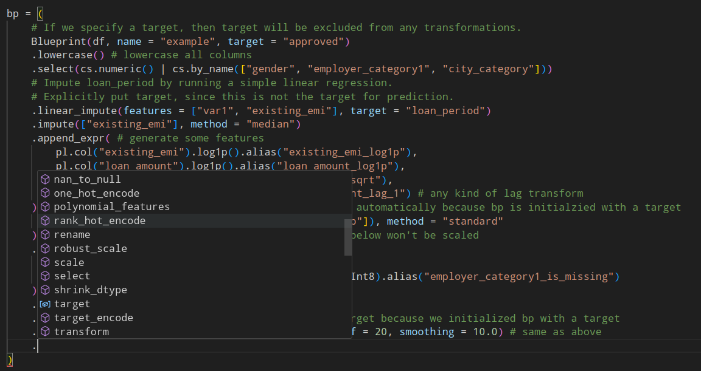

# Not Really Standard

Scikit-learn is a great package but that doesn't mean it is perfect nor it cannot be improved. I use Scikit-learn daily and I think I have my fair share of critiques on it. There are many other things to say about Scikit-learn, such as it is slow, hard to get true parallelism working, not Dataframe-centric, the functions/Transformers it provides are not expressive enough, not easy to serialize, or jsonify, etc. All these issues are addressed or partially addressed by PDS (polars_ds). However, my biggest complaint is about the Pipeline API in Scikit-learn.



PDS offers an extensible class for the most common ML pipeline transforms. You can also extend and customize it, which you can find in examples/pipeline.ipynb. You can even completely describe a pipeline with transforms using dictionaries and lists if you want. You don't have to remember the names of these transformers becasue your linter will auto complete for you. The pipeline construction is designed to be dataframe centric and as expressive as possible: any data scientist who spends a few seconds looking at it will know what it will do. Everything in PDS just comes with the package and requires no dependency, not even on SciPy or NumPy (besides when interacting with NumPy is necessary.)

I also don't like the idea of putting model in a Pipeline, which Scikit-learn allows, but is not a good idea in my opinion. For isntance, there is no `.predict`, `.predict_proba` in polars_ds pipelines. Here are three reasons for my design decision:

1. Doing so complicates the expected output of the pipeline and makes the object too bloated. In practice, people track the **raw features**, **the transformed features**, and also the **model scores**. How do we get all 3 data points without evaluating the pipeline multiple times? In sklearn, the solution is that you will have to manually exclude the model, let the rest of the transformations run, then evaluate the model. This brings the question of why should models be included in the pipeline in the first place?  

2. Feature transformations and model training should be isolated environments. The PDS pipeline will only take in raw features and get transformed features out. Models are separate entities and should be kept and managed separately. Say you are doing hyper-parameter training and you only want to tune the hyper-parameters of the model. But your model is inside a sklearn pipeline. What will happen every time you try a new set of hyper-parameters? The whole pipeline will run, despite the fact that the data tranformation part is identical each time. To avoid this, you will have to cache the data with options provided by sklearn. Why not do it naturally (using a data-transformation-only pipeline + a model), instead of relying on additional configuration? For things like caching, it is often better to let the user manage it themself than coming up with an option that might solve the issue for some people. Adding an option like that only adds complexity to the software and burden on the maintainers. 

3. A cleaner and smaller API. The scikit-learn pipeline API provide calls like `.predict_proba()`,  `.predict_log_proba`, `.score` etc. However, depending on the contents of the pipeline, they may not be avialable or may not be what one expects. Too many function calls work situationally. This can be naturally solved if the user manages the data-transformation and the model separately. By following this separation of concern, the user will always know what exactly is being used as the model and the user will know immediately what is available and what is not available on the model object.

As it stands now, polars_ds pipelines can be turned into a Sklearn pipeline, but not the other way around, and I do not plan to support the other way around. Since polars_ds is Polars native, it can run much faster and have a (surprisingly) more flexible API in many cases. Passing selectors such as `cs.numerics()`, or `pl.col("*").exclude(...)` to sklearn-style pipeline step is just impossible because of their lack of native Polars support. 

I think there is a lack of spirit in exploring new APIs that actually faciliates developer experience and I do not want to confine myself to the pre-defined world of "works with Scikit-learn". That said, common names are respected and work as intended. The accepted and most common terminologies will be used to name the functions and methods. E.g `.fit(...)` and `.transform(...)` are still used in Polars DS as in the Scikit-learn sense.

# Wrapping Polars DS pipelines inside a Sklearn Transformer

It is possible, though not recommended. If there is a transform that you really want, please open a feature request. Thank you! You can find the dataset used in the example in ../examples/ folder on github.

```python

import polars_ds.pipeline as pds_pipe
from sklearn.pipeline import Pipeline
from sklearn.base import BaseEstimator, TransformerMixin

class CustomPDSTransformer(BaseEstimator, TransformerMixin):

    def __init__(self):
        self.pipe = None

    def fit(self, df, y=None):
        # specify all the rules for the transform here
        bp = (
            pds_pipe.Blueprint(df, name = "example", target = "approved", lowercase=True) 
            .filter( 
                "city_category is not null" # or equivalently, you can do: pl.col("city_category").is_not_null()
            )
            .select(cs.numeric() | cs.by_name(["gender", "employer_category1", "city_category", "test_col"]))
            .linear_impute(features = ["var1", "existing_emi"], target = "loan_period") 
            .impute(["existing_emi"], method = "median")
        )
        self.pipe = bp.materialize()
        return self

    def transform(self, df, y=None):
        return self.pipe.transform(df)

# ---------------------------------------------------------------

df = pl.read_parquet("../examples/dependency.parquet")
df.head()

pipe = Pipeline(
    steps=[
        ("CustomPDSTransformer", CustomPDSTransformer())    
    ]
)
df_transformed = pipe.fit_transform(df)
df_transformed
```